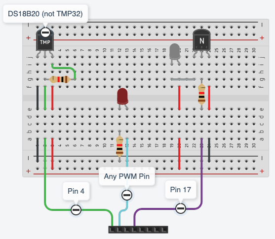

# (Raspberry Pi) Thermostat Webserver
This is the repo containing the python-based webserver that will be ran on a Raspberry Pi which will control a heat pump using an ir led, temperature sensor, and a webserver.

## Setup
To set the libraries up, simply run `python3 -m pip install -r requirements.txt`.

Before running, you'll want to set up the `config.json` file to include:
- controller name (defined by lircd.conf): `controller`
- hashed api key: `hashed-api-key`
- red led pin: `red_pin`
- green led pin: `green_pin`
- blue led pin: `blue_pin`

You can refer to `config_example.json` for an example of this configuration.

You'll want to install the `@types/jquery` npm module if you plan on writing any typescript. To do so just run `npm insatll --save @types/jquer` from the `src` directory.

## Running the Web Server
To run the web server, simply run `main.py` which should automatically set up everything.

## Other requirements
This repo only contains the code necessary to run the web server, and nothing more. So an automated installation and running process will have to be set up elsewhere.

## Working with the Virtual Environment
To activate the python virtual environment, simply run (from the base dir):
```
$ source env/bin/activate
(env) $
```

To deactivate the environment, simply run (from the base dir):
```
(env) $ deactivate
$
```

## Wiring
Here is the wiring diagram for the circuit. Please note that __not all parts shown are accurate__, they're just what was available on TinkerCad...



## Further Reading
Here are resources for further development:
- https://towardsdatascience.com/python-webserver-with-flask-and-raspberry-pi-398423cc6f5d
- https://medium.com/@camilloaddis/smart-air-conditioner-with-raspberry-pi-an-odissey-2a5b438fe984
- https://www.raspberrypi.org/forums/viewtopic.php?t=235256
- https://devkimchi.com/2020/08/12/turning-raspberry-pi-into-remote-controller/
